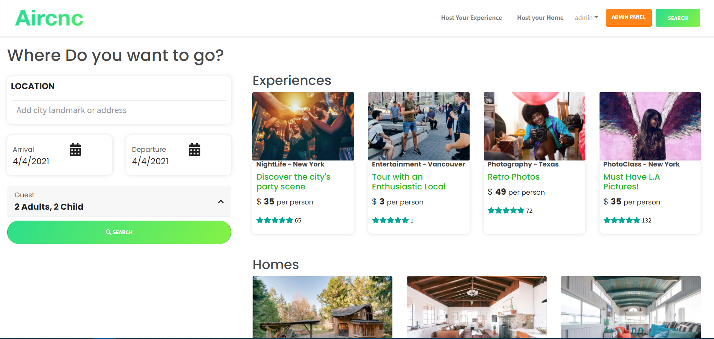
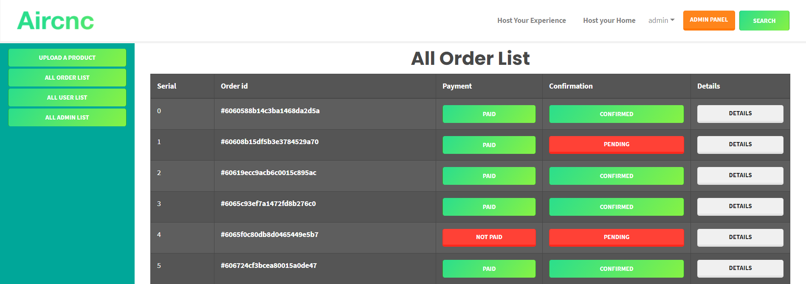

# Aircnc
---

## Sample Preview

#### Home Page

#### Admin Panel

---
## Overview
Aircnc is a one page full stack web application where different types of tours and home list are previewed to book. Authentic users can only book a trip using paypal payment. Admin panel for accept the order or crating new tours or homes booking list.

---
## Features
1. List of Trips
2. Search and filtering 
3. Dynamic Pages
4. User Authentication and Authorization
5. Admin Panel for creating, receiving Orders 
6. PayPal Payment Gateway

---

## Technologies Used
1. JavaScript
2. React.Js
3. React Bootstrap
4. Redux
5. Node.Js
6. Express.Js
7. MongoDB
8. Mongoose
9. React Helmet
10. Bcrypt
11. Json Web Token
12. React Calendar
13. Axios
14. Heroku
    

---
[live_Site_Preview](https://aircncweb.netlify.app/)
